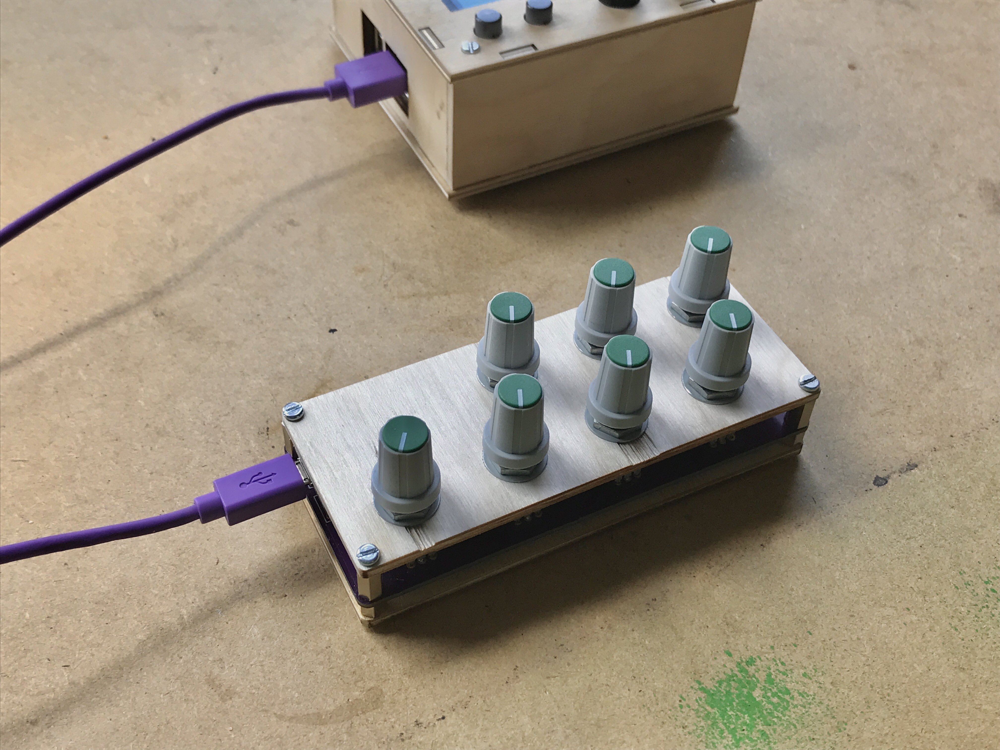
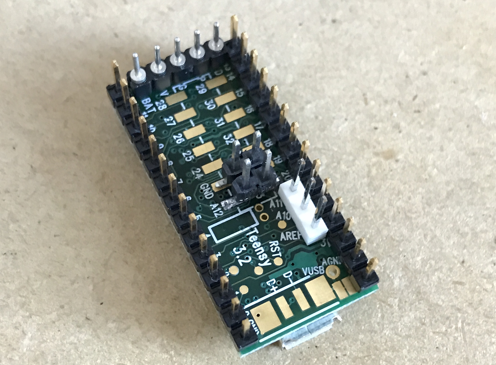

## bleached
small/inexpensive 7-knob teensy midi controller. 

many thanks to brian crabtree for sending me the original design & helping me add the teensy !!

## BOM

- [full BOM other than knobs](https://octopart.com/bom-tool/u6LfSTSI)
- [knobs from thonk (uk)](https://www.thonk.co.uk/shop/intellijel-black-knobs/) - [caps](https://www.thonk.co.uk/shop/sifam-caps/)

## Build

start with soldering all header pins to the underside of the teensy 3.2, reference the pic below for placement. the goal is to hit all of the power/ground pinouts along with the analog ins. solder short sides the two through-hole pins to the teensy. 

getting the surface mount pins in the right place is the trickiest part of this porject. start with those (one leg at a time), use tweezers, and test placement on the board with the through-hole headers.

the rest should be pretty easy, solder all the other headers to the teensy, solder the teensy to the board (on the top / stencil side of the board), and solder every leg of each of the pots. load firmware & test once everything is soldered (although, at this point there's kinda no going back). the firmware is an arduino project for use with [teensyduino](https://www.pjrc.com/teensy/teensyduino.html).

next, add the metal standoffs, shorter ones on the bottom, taller ones on top. then screw in the panels. if you want the pots extra stable you can add the nuts and washers that come with the potentiometers. then plop on yr favorite knobs & yr golden !
